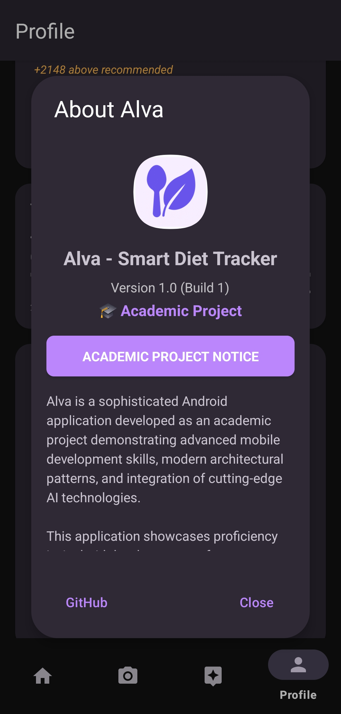

# Alva - Smart Diet & Calorie Tracker

[](https://developer.android.com/)
[](https://kotlinlang.org/)
[](https://android-arsenal.com/api?level=24)
[](https://developer.android.com/jetpack/guide)
[](#academic-context)

> **Academic Project Notice**: This application was developed as part of an academic curriculum to demonstrate advanced Android development skills, modern architectural patterns, and integration of cutting-edge AI technologies. This project showcases proficiency in mobile application development, software engineering principles, and emerging technology adoption.

## Table of Contents

- [Overview](#overview)
- [Academic Context](#academic-context)
- [Features](#features)
- [Technical Architecture](#technical-architecture)
- [Screenshots](#screenshots)
- [Technology Stack](#technology-stack)
- [Getting Started](#getting-started)
- [API Configuration](#🔑-api-configuration)
- [Project Structure](#📁-project-structure)
- [Development Highlights](#development-highlights)
- [Contributing](#contributing)

## Overview

Alva is a sophisticated Android application that revolutionizes nutrition tracking through the integration of artificial intelligence, computer vision, and modern Android development practices. The app provides users with multiple methods to track their caloric intake while offering personalized nutrition guidance through an intelligent AI assistant.

### Key Innovation Points:
- **Dual AI Integration**: Seamless integration with both OpenAI and Google Gemini APIs
- **Computer Vision**: Real-time food recognition using advanced machine learning
- **Intelligent Barcode Scanning**: Instant nutritional information from product databases
- **Conversational AI**: Personalized nutrition advice and meal planning assistance
- **Advanced Analytics**: Comprehensive statistical analysis with predictive insights

## Academic Context

### Educational Objectives Demonstrated:
- **Mobile Application Development**: Advanced Android development with Kotlin
- **Software Architecture**: Implementation of clean MVVM architecture with Repository pattern
- **Database Management**: Complex Room database design with migration strategies
- **API Integration**: RESTful API consumption and error handling best practices
- **Modern Development Practices**: Coroutines, LiveData, ViewBinding, and Material Design 3
- **AI Technology Integration**: Practical implementation of machine learning APIs
- **Performance Optimization**: Memory management, query optimization, and network efficiency

### Assessment Criteria Addressed:
**Technical Implementation**: Demonstrates mastery of Android SDK and Kotlin language  
**Architecture Design**: Clean code principles and separation of concerns  
**Innovation**: Integration of cutting-edge AI technologies  
**User Experience**: Intuitive interface design and accessibility considerations  
**Documentation**: Comprehensive technical documentation and code comments  
**Testing Readiness**: Testable architecture with dependency injection patterns  

## Features

### Smart Food Tracking
- **AI-Powered Food Recognition**: Take photos of meals for instant calorie estimation
- **Barcode Scanning**: Scan packaged foods for immediate nutritional information
- **Manual Entry**: Quick and flexible manual food entry with auto-completion
- **Nutritional Breakdown**: Complete macronutrient analysis (protein, carbs, fats, fiber)

### Intelligent AI Assistant
- **Personalized Nutrition Advice**: Context-aware recommendations based on user profile and history
- **Meal Planning**: Custom meal suggestions aligned with dietary goals and preferences
- **Progress Analysis**: Intelligent analysis of eating patterns and goal achievement
- **Conversational Interface**: Natural language interaction for nutrition guidance

### Advanced Analytics
- **Real-time Progress Tracking**: Dynamic calorie progress with goal visualization
- **Weekly & Monthly Statistics**: Comprehensive trend analysis and achievement metrics
- **BMI Calculation**: Automatic health metrics with category recommendations
- **Goal Setting**: Intelligent calorie goal recommendations based on activity level

### Comprehensive Profile Management
- **Detailed Health Metrics**: Age, height, weight, activity level, and dietary preferences
- **Avatar Customization**: Personalized profile pictures from curated avatar collection
- **Data Management**: Complete data export/import functionality for backup and portability
- **Privacy Controls**: Local data storage with user-controlled data sharing

### Modern User Experience
- **Material Design 3**: Contemporary UI with dynamic theming and accessibility features
- **Responsive Design**: Optimized for various screen sizes and orientations
- **Offline Functionality**: Core features available without internet connectivity
- **Performance Optimized**: Smooth animations and efficient resource utilization

## Technical Architecture

### MVVM Architecture Implementation
```
┌─────────────────┐    ┌──────────────────┐    ┌─────────────────┐
│                 │    │                  │    │                 │
│  View Layer     │◄───┤  ViewModel Layer │◄───┤  Model Layer    │
│                 │    │                  │    │                 │
│ • Fragments     │    │ • LiveData       │    │ • Repositories  │
│ • Activities    │    │ • State Mgmt     │    │ • Database      │
│ • Adapters      │    │ • Business Logic │    │ • Network APIs  │
│                 │    │                  │    │                 │
└─────────────────┘    └──────────────────┘    └─────────────────┘
```

### Data Flow Architecture
```
UI Components → ViewModels → Repositories → Data Sources
     ↑                                            ↓
LiveData Observers ← State Management ← Data Processing
```
### Navigation Flow


### Class Diagram


### Core Components:
- **Room Database**: Local data persistence with sophisticated query optimization
- **Retrofit + OkHttp**: Network communication with intelligent error handling
- **CameraX + ML Kit**: Modern camera implementation with machine learning integration
- **Coroutines**: Asynchronous programming with lifecycle-aware scope management
- **Repository Pattern**: Abstraction layer for data source management

## Screenshots


<table>
<tr>
<td><br/><b>Home Dashboard</b></td>
<td><br/><b>Home Dashboard</b></td>
<td><br/><b>Home Dashboard</b></td>
<td><br/><b>Home Dashboard</b></td>
</tr>
<tr>
<td><br/><b>Food Recognition</b></td>
<td><br/><b>Food Recognition</b></td>
<td><br/><b>Food Recognition</b></td>
<td><br/><b>Food Recognition</b></td>
</tr>
<tr>
<td><br/><b>AI Assistant</b></td>
<td><br/><b>AI Assistant</b></td>
<td><br/><b>AI Assistant</b></td>
<td><br/><b>AI Assistant</b></td>
</tr>
<tr>
<td><br/><b>Profile Management</b></td>
<td><br/><b>Profile Management</b></td>
<td><br/><b>Profile Management</b></td>
<td><br/><b>Profile Management</b></td>
</tr>
</table>

> **Note**:

## Technology Stack

### Core Technologies
- **Language**: Kotlin 2.0+
- **Platform**: Android SDK (API 24-34)
- **Architecture**: MVVM with Repository Pattern
- **Build System**: Gradle with Kotlin DSL

### Android Jetpack Components
- **Room**: Database persistence and ORM
- **LiveData**: Reactive data observation
- **ViewModel**: UI-related data management
- **Navigation Component**: Fragment navigation
- **CameraX**: Modern camera implementation
- **DataStore**: Preference management

### External Libraries & APIs
- **AI Integration**:
  - OpenAI GPT API/Google Gemini API for conversational AI
  - Google Gemini API for vision and advanced reasoning
- **Computer Vision**:
  - ML Kit for barcode scanning
  - Custom image processing for food recognition
- **Networking**:
  - Retrofit 2.9.0 for REST API communication
  - OkHttp for HTTP client management
  - Gson for JSON serialization
- **Image Processing**:
  - Glide 4.16.0 for efficient image loading
- **Data Visualization**:
  - MPAndroidChart for statistical displays
- **External APIs**:
  - OpenFoodFacts for product nutritional data

### Development Tools
- **Android Studio Ladybug+**
- **Gradle 8.11.1**
- **ProGuard/R8** for code optimization

## Getting Started

### Prerequisites
- Android Studio Arctic Fox or newer
- Android SDK API 24-34
- JDK 11 or higher
- Git for version control

### Installation Steps

1. **Clone the Repository**
   ```bash
   git clone https://github.com/Indexohmany/Alva.git
   cd Alva
   ```

2. **Open in Android Studio**
   - Launch Android Studio
   - Select "Open an Existing Project"
   - Navigate to the cloned directory and open it

3. **Configure API Keys** (See [API Configuration](#api-configuration))

4. **Build the Project**
   ```bash
   ./gradlew build
   ```

5. **Run on Device/Emulator**
   - Connect an Android device or start an emulator
   - Click the "Run" button in Android Studio

### Project Setup
```bash
# Install dependencies
./gradlew dependencies

# Run tests
./gradlew test

# Generate debug APK
./gradlew assembleDebug

# Generate release APK (requires signing configuration)
./gradlew assembleRelease
```

## 🔑 API Configuration

For full functionality, configure the following APIs (We've used Gemini api for our tests):

### Required API Keys
Create a `local.properties` file in the project root:

```properties
# OpenAI API Configuration
OPENAI_API_KEY=your_openai_api_key_here

# Google Gemini API Configuration  
GEMINI_API_KEY=your_gemini_api_key_here
```

### API Key Acquisition:

1. **OpenAI API Key**:
   - Visit [OpenAI Platform](https://platform.openai.com/)
   - Create an account and navigate to API Keys
   - Generate a new API key
   - Add to `local.properties` as shown above

2. **Google Gemini API Key**:
   - Visit [Google AI Studio](https://makersuite.google.com/)
   - Create a project and enable the Gemini API
   - Generate an API key
   - Add to `local.properties` as shown above

### Optional APIs:
- **OpenFoodFacts**: No API key required (public API)
- **ML Kit**: Included in Google Play Services

> **⚠️ Security Note**: Never commit API keys to version control. The `local.properties` file is automatically ignored by Git.

## 📁 Project Structure

```
app/src/main/
├── java/com/example/alva/
│   ├── data/                          # Data layer
│   │   ├── api/                       # API service definitions
│   │   ├── database/                  # Room database components
│   │   │   ├── converters/            # Type converters
│   │   │   ├── dao/                   # Data Access Objects
│   │   │   ├── entities/              # Database entities
│   │   │   └── mappers/               # Entity-model mappers
│   │   ├── models/                    # Data models
│   │   ├── network/                   # Network management
│   │   └── repository/                # Repository implementations
│   ├── ui/                            # Presentation layer
│   │   ├── aiassistant/               # AI chat interface
│   │   ├── camera/                    # Camera functionality
│   │   ├── dialogs/                   # Dialog components
│   │   ├── home/                      # Main dashboard
│   │   └── profile/                   # Profile management
│   ├── utils/                         # Utility classes
│   ├── AlvaApplication.kt             # Application class
│   └── MainActivity.kt                # Main activity
├── res/                               # Application resources
│   ├── layout/                        # XML layouts
│   ├── values/                        # Strings, colors, styles
│   ├── drawable/                      # Vector graphics
│   ├── navigation/                    # Navigation graphs
│   └── menu/                          # Menu definitions
└── assets/                            # Static assets
    └── avatars/                       # Avatar images
```

## Development Highlights

### Architecture Patterns
- **MVVM Implementation**: Clean separation between UI and business logic
- **Repository Pattern**: Centralized data access with multiple source coordination
- **Observer Pattern**: Reactive UI updates through LiveData
- **Singleton Pattern**: Thread-safe resource management

### Advanced Features
- **Dual AI Provider Strategy**: Intelligent fallback between OpenAI and Gemini APIs
- **Computer Vision Pipeline**: Image compression → API processing → Response parsing
- **Offline-First Architecture**: Local database with intelligent syncing
- **Statistical Analysis Engine**: Complex date-range queries for analytics

### Code Quality Measures
- **Kotlin Best Practices**: Coroutines, extension functions, sealed classes
- **Error Handling**: Comprehensive exception management with user-friendly messages
- **Memory Management**: Proper lifecycle handling and resource cleanup
- **Performance Optimization**: Database indexing, query optimization, and caching strategies


## Contributing

We welcome all types of contributions from anyone! Feel free to contribute in whatever way you'd like, whether it's code improvements, documentation, bug fixes, new features, design changes, or creative ideas. There are no restrictions on the type or scope of contributions.

### How to Contribute
- Fork the repository
- Make your changes
- Submit a pull request
- Open issues for bugs or suggestions
- Start discussions about new ideas

### Development Guidelines
```bash
# Create feature branch
git checkout -b feature/new_feature

# Make changes with descriptive commits
git commit -m "Add: Comprehensive error handling documentation"

# Push and create pull request
git push origin feature/new_feature
```


---


<div align="center">

**Alva Diet Tracker** - *Smart Nutrition Through Technology*

*Developed as an academic project demonstrating advanced Android development skills and modern software engineering practices.*

[](#)
[](#academic-context)
[](https://developer.android.com/)

</div>